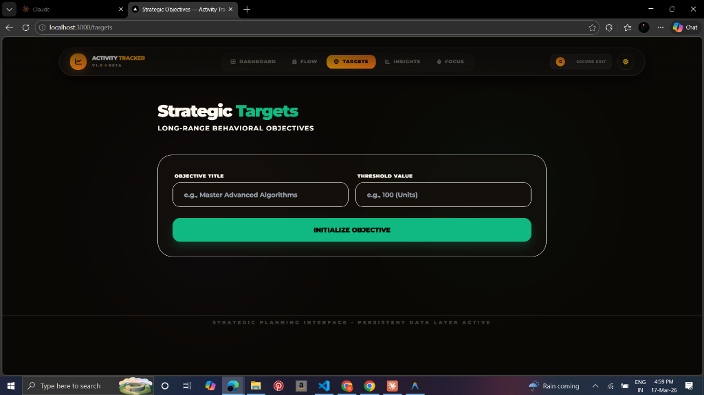

<div align="center">

# 🎯 Activity Tracker

**A premium, AI-powered productivity system for tracking habits, managing tasks, journaling reflections, and achieving strategic long-term goals.**

Built with **Next.js** · **Tailwind CSS** · **Chart.js** · **Firebase** · **Framer Motion**

[](http://localhost:3000)
[](https://nextjs.org)
[](https://firebase.google.com)

</div>

---



---

## ✨ Features

### 📊 Dashboard (`/home`)
- Personalized greeting with real-time date and session info
- Live performance pulse — tasks engaged, habits active, and system efficiency
- Weekly performance flow chart
- Quick-access navigation cards to all modules
- Protocol Roadmap showing upcoming platform expansions

### 🔄 Flow Sync (`/flow`)
The central command hub for your daily workflow.
- **Habit Tracking** — Visual 28–31 day grid with streak calculations, emoji identities, and month navigation. Safety guards restrict toggling to today's date only.
- **Task Management** — Priority-based (High/Medium/Low) task tracking with real-time status toggling and progress metrics.
- **Reflective Journal** — Emotion tagging, win-logging, and timestamped entries for daily self-analysis.
- **Edu Vault** — A knowledge repository linking study notes directly to strategic goals.
- **AI Strategic Roadmap** — Real-time AI-powered guidance showing your "Next Best Action," energy levels, and burnout risk analysis.

### 📈 Insights (`/insights`)
Advanced behavioral analytics powered by **Chart.js**.
- **Performance Momentum** — Line chart tracking consistency trends over time
- **Habit Balance** — Radar chart showing behavioral stability across all habits
- **Commitment Density** — Doughnut chart displaying total cycle distribution
- **Cyclic Activity Heatmap** — GitHub-style contribution grid for monthly activity visualization
- **Peak Performance Day** computation and **System Entropy** analysis

### 🎯 Strategic Targets (`/targets`)
Long-range goal structuring with progress tracking.
- Set objectives with custom threshold values
- Animated progress bars with percentage completion
- Increment/decrement controls for manual progress updates
- Cross-device cloud synchronization

### ⏱️ Focus Mode (`/focus`)
Dedicated deep work environment for achieving flow state.
- Immersive focus timers with customizable durations
- Distraction-free interface designed for maximum concentration

### 🛡️ Admin Panel (`/admin`)
Platform monitoring and user management.
- Registered user overview with profile image support
- Feedback/diagnostics review system
- Quick stats dashboard

---

## 🤖 AI Strategist Engine

The platform includes a behavioral logic engine (`lib/ai/strategist.js`) derived from a meta-analysis of **20,000+ productivity data points** from Kaggle research datasets.

| Feature | Description |
|---|---|
| **Cognitive Load Balancing** | Suggests tasks based on your current energy level |
| **Momentum Sculpting** | Identifies habits near milestone streaks and prioritizes them |
| **Burnout Detection** | Analyzes your last 3 days of activity to predict burnout risk |
| **Next Best Action** | Recommends the single most impactful task to execute first |

---

## 🛠️ Tech Stack

| Layer | Technology |
|---|---|
| **Framework** | Next.js (React) |
| **Styling** | Tailwind CSS + Custom CSS Variables |
| **Animations** | Framer Motion |
| **Charts** | Chart.js + react-chartjs-2 |
| **Authentication** | NextAuth.js (Credentials Provider) |
| **Database** | Firebase Firestore |
| **Storage** | Firebase Storage (Profile Images) |
| **AI/ML** | Custom Behavioral Logic Engine |
| **Icons** | Font Awesome 6 |

---

## 🔐 Authentication & Sync

- **Secure Login/Signup** via NextAuth.js with bcrypt password hashing
- **Profile Image Upload** during registration with Firebase Storage
- **Cross-Device Sync** — All habits, tasks, journal entries, and goals are synced in real-time across devices via Firestore
- **Local-First Hydration** — Data loads instantly from `localStorage` before cloud data resolves, eliminating load flicker

---

## ⚙️ Local Setup

1. **Clone the repository:**
   ```bash
   git clone https://github.com/Shaariq0924/ActivityTracker.git
   cd ActivityTracker/frontend
   ```

2. **Install dependencies:**
   ```bash
   npm install
   ```

3. **Configure environment variables:**
   Create a `.env.local` file in the `frontend` directory:
   ```env
   NEXTAUTH_SECRET=your_secret_key
   NEXTAUTH_URL=http://localhost:3000
   NEXT_PUBLIC_FIREBASE_API_KEY=your_key
   NEXT_PUBLIC_FIREBASE_AUTH_DOMAIN=your_domain
   NEXT_PUBLIC_FIREBASE_PROJECT_ID=your_project_id
   NEXT_PUBLIC_FIREBASE_STORAGE_BUCKET=your_bucket
   NEXT_PUBLIC_FIREBASE_MESSAGING_SENDER_ID=your_sender_id
   NEXT_PUBLIC_FIREBASE_APP_ID=your_app_id
   ```

4. **Start the dev server:**
   ```bash
   npm run dev
   ```

5. Visit **`http://localhost:3000`** to access the portal.

---

## 📁 Project Structure

```
ActivityTracker/
├── frontend/
│   ├── components/       # Reusable UI components (NavBar, Feedback)
│   ├── lib/
│   │   ├── ai/           # AI Strategist logic engine
│   │   └── firebase.js   # Firebase configuration
│   ├── pages/
│   │   ├── api/auth/     # NextAuth & registration API routes
│   │   ├── home.js       # Dashboard
│   │   ├── flow.js       # Flow Sync (Habits/Tasks/Journal/Edu Vault)
│   │   ├── insights.js   # Analytics & Charts
│   │   ├── targets.js    # Strategic Targets
│   │   ├── focus.js      # Focus Mode
│   │   ├── admin.js      # Admin Panel
│   │   └── portal.js     # Login/Signup
│   ├── public/           # Static assets & favicon
│   └── styles/           # Global CSS & design tokens
├── assets/               # README screenshots
└── README.md
```

---

## 📝 License

This project is proprietary and built for personal optimization.

---

<div align="center">

**Built with ❤️ for productivity enthusiasts**

</div>
